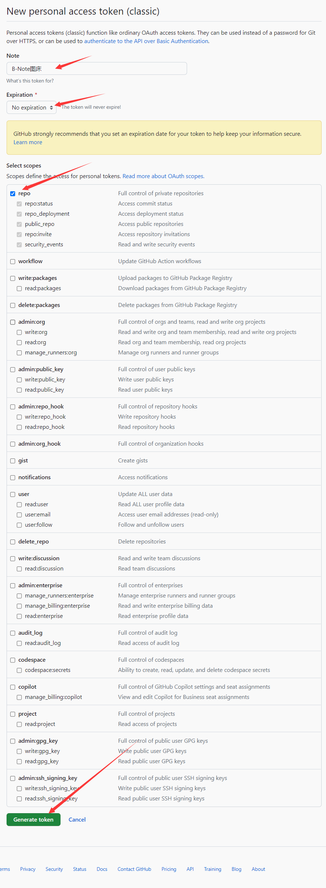

# 如何在Github搭建图床并在B-Note油猴脚本中使用
图床可以理解为一个存放图片的云盘。我们可以将本地图片上传到“云”，然后获取图片在“云”的地址（链接）。我们可在其他地方直接使用这个链接而再次获取图片。这里将介绍如何在Github上搭建一个免费的图床。

## 1. 准备工作
在开始之前，你需要一个Github账号。如果你还没有，可以前往 [Github 官网](https://github.com/)进行注册。

## 2. 过程
1. 登录Github账号后，点击右上角的头像，选择 "Your repository"，再点击“New”创建一个新的仓库。

   
   
   
   
   
   
3. 填写仓库相关信息。选择一个合适的仓库名，例如“B-Note_img”，然后确保仓库的权限为 "Public"。其他设置可以保持默认。然后点击“Create repository”。创建成功后，你将看到仓库的主页。

   

5. 获取github token。点击头像，选择“Settings”。然后再点击“Developer settings”。
 > GitHub的token，是GitHub提供的一种身份验证方式。它是一个长字符串，代表了你的GitHub账户和权限。你可以在GitHub的设置中生成一个token，并给它分配一些权限，如读取仓库、写入仓库、删除仓库等。然后，你可以在需要身份验证的地方使用这个token。使用token的好处是，你不需要在每个需要身份验证的地方都输入你的用户名和密码，只需要提供这个token就可以了。并且，你可以随时撤销一个token，这样就可以立即取消它的所有权限，而不需要修改密码。但是，token非常敏感，一旦泄露，别人就可以以你的名义进行操作。所以，你应该小心保管你的token，不要在公开的地方泄露它，也不要在不必要的地方使用它。如果你怀疑一个token已经泄露，你应该立即在GitHub的设置中撤销它。在哔记油猴脚本中，token只保存在你的本地。请注意不要在其它场合泄露。

4. 点击“Personal access tokens”。选择“Tokens(classic)”。再点击"Generate new token"。选择“Generate new token (classic)”。

   
   
   

6. 填写Note，例如“B-Note图床”。选择“Expiration”为“No expiration”。同时勾选"repo"。最后点击“Generate token”即可获得token。点击复制，token只会显示一次，无法之后再次查看， 可以将token保存起来以备之后使用。

   
   
   

8. 配置B-Note使其能够上传图片到GitHub中。点击油猴插件图标。然后选中脚本旁边的">"图标，再点击"编辑"。就进入脚本代码页面。找到"let token = ‘此处粘贴token’"这一行。粘贴刚刚保存的token（注意要使得token是被单引号包括）。找到"let repo = ‘此处粘贴仓库名’"（注意要使得仓库名是被单引号包括）。仓库名获取方式可以查看你刚刚创建的仓库，例如你的仓库显示为”Xiang-yuZHAO/B-Note_img“，你的仓库名就应该填"Xiang-yuZHAO/B-Note_img"（可参考下图确定你自己的仓库名）。

   
   
   
   
   
   

至此，你已经成功创建了一个Github图床，获取了token，并且在哔记中配置好了github图床。接下来，你可以使用哔记（B-Note）记录笔记，并自动上传图片到这个仓库，并通过Github提供的URL来引用这些图片。

